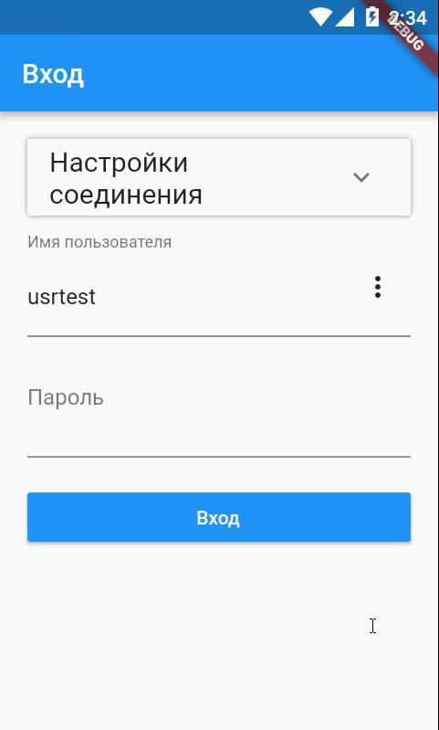

### sap_connect - the package is designed to establish a connection and then execute queries to the SAP system

Visually represents a screen for setting up a connection and logging to SAP system

Connection settings are saved on the device
Provides connection and work in the language chosen by the user (internationalization)
After the connection is established, it allows you to perform queries to the SAP server

**To make this package work, you must install to the SAP server package [YDK_WEBS](https://github.com/DKiyanov/YDK_WEBS).**

